<div align="center">


<br/>

<a href="https://github.com/FatemehDehghan224">
  
</a>

<br/>

<a href="mailto:ftmdqn2244@gmail.com">
  
</a>
<a href="https://www.linkedin.com/in/fatemeh-dehghan-198404367/">
  
</a>
<a href="https://github.com/FatemehDehghan224">
  
</a>


</div>

<br/>


## `01` ── About me

> **AI Engineer focused on turning language models into practical products.**

I work on **LLM applications, Retrieval-Augmented Generation (RAG), AI agents, vector search, and intelligent backend services**.  
My projects sit at the intersection of **language, audio, vision, APIs, and production-minded backend engineering**.

```python
fatemeh = {
    "role": "AI Engineer",
    "focus": ["LLM Applications", "RAG", "AI Agents", "Vector Search"],
    "backend": ["Python", "Django", "DRF", "FastAPI"],
    "infra": ["PostgreSQL", "Redis", "Celery", "Docker", "Linux"],
    "currently": "AI Engineer @ Fawan Company",
    "mindset": "build → measure → improve → ship"
}
```

---

## `02` ── Selected work

<table>
<tr>
<td width="50%" valign="top">

</td>
<td width="50%" valign="top">

</td>
</tr>
<tr>
<td width="50%" valign="top">

</td>
<td width="50%" valign="top">

</td>
</tr>
</table>

---

## `03` ── Tech constellation

<div align="center">

### AI / LLM


### Backend / Data / Infra


### Vision & Retrieval


&nbsp;


</div>

---

## `04` ── One architecture I enjoy building

```mermaid
flowchart LR
    A[Raw Data<br/>Text · Audio · Images] --> B[Preprocessing]
    B --> C[Chunking / Feature Extraction]
    C --> D[Embeddings]
    D --> E[(Vector DB)]
    E --> F[Retrieve + Filter + Rerank]
    F --> G[LLM / Agent]
    G --> H[Useful Product Output]

    classDef source fill:#111827,stroke:#8B5CF6,color:#fff;
    classDef process fill:#0f172a,stroke:#22D3EE,color:#fff;
    classDef result fill:#111827,stroke:#F472B6,color:#fff;

    class A,E source;
    class B,C,D,F,G process;
    class H result;
```



---

## `05` ── Experience snapshot

<div align="center">

| | Role | Organization | Timeline |
|---|---|---|---|
| 🤖 | **AI Engineer** | Fawan Company | Oct 2025 — Present |
| 🧠 | **AI Intern** | AI Studio, Fawan Company | Jun 2025 — Sep 2025 |
| ⚙️ | **Backend Intern** | Naji Tejarat Company | Aug 2023 — Jan 2024 |
| 🎓 | **Teaching Assistant — AI** | Yazd University | Spring 2025 |

</div>

---

## `06` ── GitHub signal

<div align="center">


<br/><br/>


</div>


<br/>

<div align="center">

### I like AI most when it leaves the notebook and becomes a real product.


</div>
